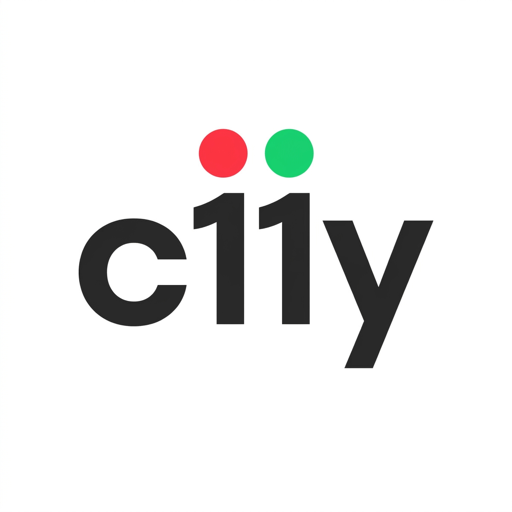
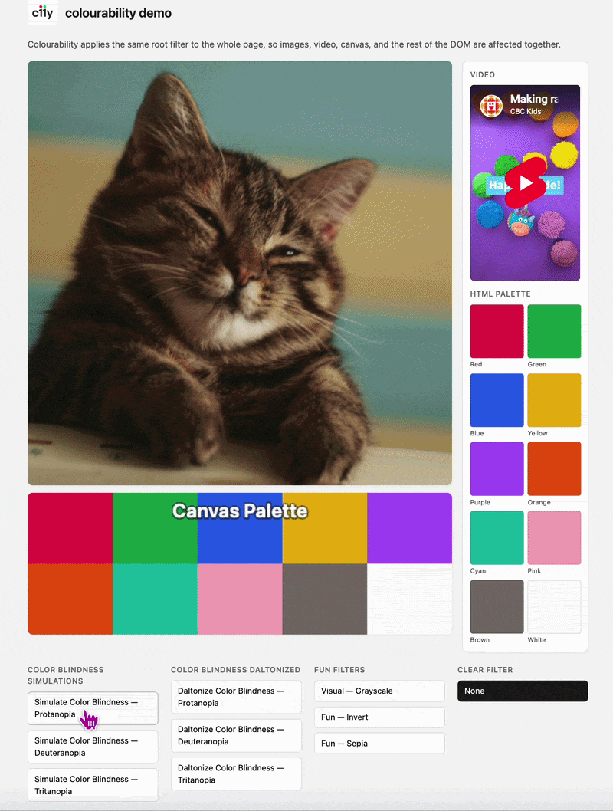

<div align="center">
  
</div>


# colourability

<p align="center">
  <a href="https://www.npmjs.com/package/colourability"></a>
  <a href="https://github.com/mayukh-dsc/colourability/actions/workflows/ci.yml"></a>
  <a href="https://opensource.org/licenses/MIT"></a>
</p>

**Test and improve color accessibility on real webpages** with one tiny, zero-dependency TypeScript library.

`colourability` applies color transformations at the page level using a single SVG [`feColorMatrix`](https://developer.mozilla.org/en-US/docs/Web/SVG/Element/feColorMatrix), so it affects the entire *DOM including Videos and Canvas elements*. 


Use it to:
- simulate common color-vision deficiencies (`protanopia`, `deuteranopia`, `tritanopia`)
- apply daltonization-style compensation matrices
- tune strength live with intensity (`0..1`)
- run custom 20-value matrices when needed

## See it in action

<p align="center">
  
</p>

*The interactive demo applies the same filter to the whole page—images, `<video>`, `<canvas>`, and the rest of the DOM—so you can compare simulation and daltonization in context.*

The recording lives next to the live demo in `demo/`. It is **not** included in the npm package (`package.json` `"files"`), so the published tarball stays small; GitHub renders it from the repository.

## Install

```bash
npm install colourability
```

## Usage

```typescript
import Colourability from 'colourability';

const c11y = new Colourability();

// Simulate deuteranopia at full strength
c11y.apply('simulateColorBlindness/deuteranopia', { intensity: 1 });

// Tune effect strength while active
c11y.setIntensity(0.7);

// Remove filter and restore prior page state
colourability.remove();
```

---

## Color-blindness workflows

### 1) Simulate what users may see

```typescript

// Red-cone deficiency simulation
c11y.apply('simulateColorBlindness/protanopia');

// Green-cone deficiency simulation
c11y.apply('simulateColorBlindness/deuteranopia');

// Blue-cone deficiency simulation
c11y.apply('simulateColorBlindness/tritanopia');
```

### 2) Apply daltonization-style compensation

```typescript

// Compensation preset (linear heuristic matrix)
c11y.apply('daltonizeColorBlindness/deuteranopia', { intensity: 1 });
c11y.setIntensity(0.85);
```

### 3) Compare quickly with a simple toggle

```typescript

c11y.apply('simulateColorBlindness/deuteranopia');

// ... inspect UI ...

c11y.remove();
```

---

## Built-in presets

Built-in ids use `category/subname`:

| Id | Purpose |
|----|---------|
| `simulateColorBlindness/protanopia` | Simulate red-cone (L) deficiency |
| `simulateColorBlindness/deuteranopia` | Simulate green-cone (M) deficiency |
| `simulateColorBlindness/tritanopia` | Simulate blue-cone (S) deficiency |
| `daltonizeColorBlindness/protanopia` | Compensation heuristic (`2I - M_sim`) |
| `daltonizeColorBlindness/deuteranopia` | Compensation heuristic (`2I - M_sim`) |
| `daltonizeColorBlindness/tritanopia` | Compensation heuristic (`2I - M_sim`) |
| `visual/grayscale` | BT.709 luminance grayscale |
| `fun/sepia` | Stylized sepia |
| `fun/invert` | Stylized invert |

`intensity` is always `0..1` and interpolates each matrix coefficient toward identity.

---

## Custom matrix

Pass a 20-number `feColorMatrix` `values` string (row-major, same format as built-ins). For example, the identity (no-op) matrix:

```typescript

const IDENTITY =
  '1 0 0 0 0 0 1 0 0 0 0 0 1 0 0 0 0 0 1 0';

c11y.applyMatrix(IDENTITY, { intensity: 0.5 });
```

## API

- `apply(name, options?)` — inject/update SVG filter and set `filter: url(#__colourability-active__)` on `<html>`
- `applyMatrix(matrix, options?)` — same as `apply`, but with a raw 20-coefficient matrix string
- `remove()` — remove SVG and restore the previous `filter` style
- `setIntensity(value)` — adjust strength while a filter is active (preset or custom matrix)
- `list()` — built-in preset ids
- `getState()` — `{ active, customMatrix, options }` — `active` is set for built-ins; `customMatrix` is set when `applyMatrix` was used

---

## Why this approach works

A hidden `<svg>` in `<head>` defines `<filter id="__colourability-active__">` with `color-interpolation-filters="linearRGB"`.
The root element then references it via CSS `filter: url(#__colourability-active__)`.

This means:
- one consistent mechanism for grayscale, simulation, and daltonization
- no fullscreen overlay hacks
- pointer events and interaction model stay natural

---

## Browser script (IIFE / UMD)

After building, load `dist/colourability.min.js` and use the global `Colourability` constructor.

---

## Versioning (0.x)

While the major version is `0`, minor releases may include breaking API or preset-id changes.
Pin the version range you need for production.

## Contributing

See [CONTRIBUTING.md](CONTRIBUTING.md).

## License

MIT — see [LICENSE](LICENSE).
